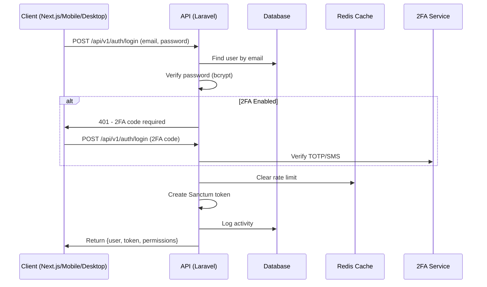
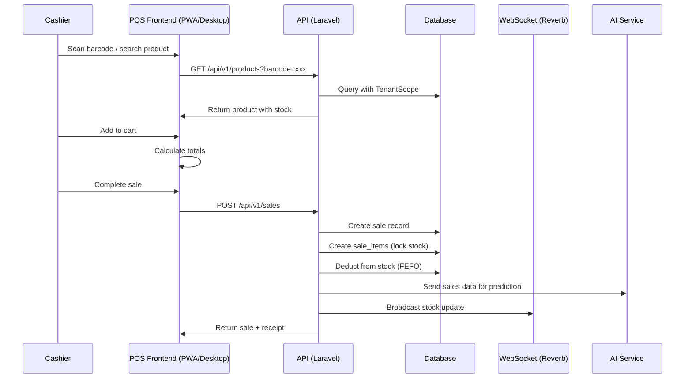
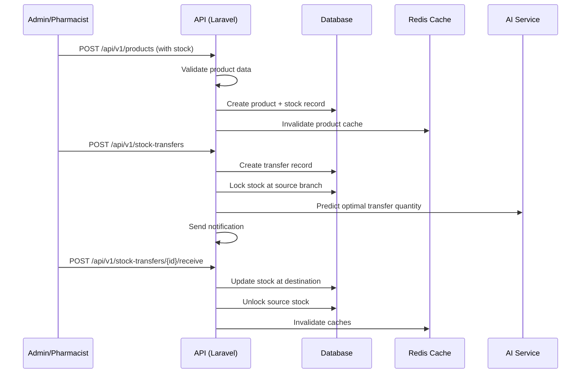
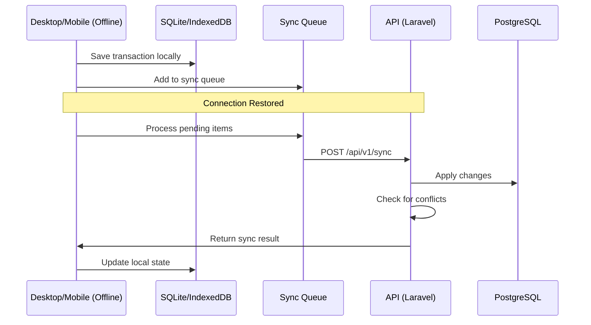

# 🏗️ توثيق البنية التقنية - Z-Syst Pharmacy Management SaaS (PharmaSync)

## 📐 البنية العامة (Architecture Overview)

```
┌─────────────────────────────────────────────────────────────────────────────┐
│                              CLIENT LAYER                                  │
│  ┌─────────────────┐  ┌─────────────────┐  ┌─────────────────┐            │
│  │   Next.js 14+    │  │  Mobile Apps    │  │  Desktop Apps   │            │
│  │   (React 18+)   │  │  (React Native) │  │  (Electron)     │            │
│  │   PWA + Offline │  │  (Flutter)      │  │  (Tauri)        │            │
│  └─────────────────┘  └─────────────────┘  └─────────────────┘            │
└─────────────────────────────────────────────────────────────────────────────┘
                                    │
                                    ▼
┌─────────────────────────────────────────────────────────────────────────────┐
│                           API GATEWAY LAYER                                   │
│  ┌─────────────────┐  ┌─────────────────┐  ┌─────────────────┐            │
│  │   Rate Limit    │  │   Auth Check    │  │  Tenant Scope   │            │
│  │   (per plan)    │  │   (Sanctum)     │  │   (Middleware)  │            │
│  └─────────────────┘  └─────────────────┘  └─────────────────┘            │
└─────────────────────────────────────────────────────────────────────────────┘
                                    │
                                    ▼
┌─────────────────────────────────────────────────────────────────────────────┐
│                           APPLICATION LAYER                                  │
│  ┌─────────────────────────────────────────────────────────────────────┐  │
│  │                          Laravel 12                                   │  │
│  │  ┌──────────────┐  ┌──────────────┐  ┌──────────────┐                  │  │
│  │  │ Controllers  │  │   Actions    │  │   Services   │                  │  │
│  │  │   (API)      │  │   (CQRS)     │  │   (Business) │                  │  │
│  │  └──────────────┘  └──────────────┘  └──────────────┘                  │  │
│  ├─────────────────────────────────────────────────────────────────────┤  │
│  │  ┌──────────────┐  ┌──────────────┐  ┌──────────────┐                  │  │
│  │  │ Form Requests│  │   Events     │  │    Jobs      │                  │  │
│  │  │  (DTOs)      │  │  (Observers) │  │  (Queues)    │                  │  │
│  │  └──────────────┘  └──────────────┘  └──────────────┘                  │  │
│  └─────────────────────────────────────────────────────────────────────┘  │
└─────────────────────────────────────────────────────────────────────────────┘
                                    │
                                    ▼
┌─────────────────────────────────────────────────────────────────────────────┐
│                           DATA ACCESS LAYER                                  │
│  ┌──────────────┐  ┌──────────────┐  ┌──────────────┐                      │
│  │  Eloquent    │  │   Queries    │  │   Caching    │                      │
│  │   Models     │  │   (Scoped)   │  │   (Redis)    │                      │
│  └──────────────┘  └──────────────┘  └──────────────┘                      │
└─────────────────────────────────────────────────────────────────────────────┘
                                    │
                                    ▼
┌─────────────────────────────────────────────────────────────────────────────┐
│                           INFRASTRUCTURE LAYER                               │
│  ┌──────────────┐  ┌──────────────┐  ┌──────────────┐  ┌──────────────┐      │
│  │ PostgreSQL   │  │    Redis     │  │   Storage    │  │   Queues     │      │
│  │   16         │  │   (Cache)    │  │   (S3/R2)    │  │  (Horizon)   │      │
│  └──────────────┘  └──────────────┘  └──────────────┘  └──────────────┘      │
└─────────────────────────────────────────────────────────────────────────────┘
                                    │
                                    ▼
┌─────────────────────────────────────────────────────────────────────────────┐
│                           AI/ML LAYER                                        │
│  ┌──────────────┐  ┌──────────────┐  ┌──────────────┐                      │
│  │  FastAPI     │  │ TensorFlow   │  │   Tesseract  │                      │
│  │  (Python)    │  │  / PyTorch   │  │   OCR        │                      │
│  └──────────────┘  └──────────────┘  └──────────────┘                      │
└─────────────────────────────────────────────────────────────────────────────┘
```

---

## 📊 Data Flow Diagrams

### 1. تدفق المصادقة (Authentication Flow)



### 2. تدفق عمل POS (POS Transaction Flow)



### 3. تدفق إدارة المخزون (Inventory Management Flow)



### 4. تدفق Offline-First (Offline-First Sync Flow)



---

## 🗺️ خريطة الوحدات (Module Map)

```
app/
├── Modules/
│   ├── Core/
│   │   ├── Contracts/          # Interfaces
│   │   ├── Services/           # Base services
│   │   ├── Traits/             # Shared traits
│   │   └── Exceptions/         # Custom exceptions
│   │
│   ├── Auth/
│   │   ├── Controllers/        # Auth controllers
│   │   ├── Requests/           # Form requests
│   │   ├── Services/           # AuthService, TwoFactorService
│   │   └── Notifications/      # Email/SMS notifications
│   │
│   ├── Pharmacy/
│   │   ├── Products/           # Product management
│   │   │   ├── Controllers/
│   │   │   ├── Services/
│   │   │   ├── Models/
│   │   │   └── Requests/
│   │   ├── Inventory/          # Stock management
│   │   │   ├── Controllers/
│   │   │   ├── Services/
│   │   │   ├── Models/
│   │   │   └── Jobs/
│   │   ├── POS/                # Point of Sale
│   │   │   ├── Controllers/
│   │   │   ├── Services/
│   │   │   └── Jobs/
│   │   ├── Prescriptions/      # Prescription handling
│   │   │   ├── Controllers/
│   │   │   ├── Services/
│   │   │   └── Models/
│   │   ├── Insurance/          # Insurance claims
│   │   │   ├── Controllers/
│   │   │   ├── Services/
│   │   │   └── Models/
│   │   └── Compliance/         # Controlled substances, audits
│   │       ├── Controllers/
│   │       ├── Services/
│   │       └── Models/
│   │
│   ├── Sales/
│   │   ├── Sales/              # Sales invoices
│   │   ├── Returns/            # Sale returns
│   │   └── Payments/           # Payment processing
│   │
│   ├── Purchases/
│   │   ├── PurchaseOrders/     # PO workflow
│   │   ├── GRN/                # Goods Received Notes
│   │   └── Returns/            # Purchase returns
│   │
│   ├── Financial/
│   │   ├── Expenses/           # Expense tracking
│   │   ├── CashRegisters/      # Cash management
│   │   ├── Accounts/           # Chart of accounts
│   │   └── Reports/            # Financial reports
│   │
│   ├── CRM/
│   │   ├── Customers/          # Customer management
│   │   ├── Doctors/            # Doctor management
│   │   ├── Loyalty/            # Loyalty points
│   │   └── Segmentation/       # Customer segmentation
│   │
│   ├── AI/
│   │   ├── Predictions/        # Demand forecasting
│   │   ├── OCR/                # Invoice recognition
│   │   ├── Recommendations/    # Smart recommendations
│   │   └── NLP/                # Natural language processing
│   │
│   └── Communication/
│       ├── Chat/               # Inter-branch messaging
│       ├── Notifications/      # Multi-channel notifications
│       └── Events/             # Calendar and events
```

---

## 🗃️ ERD (Entity Relationship Diagram)

```mermaid
erDiagram
    %% Core Multi-Tenancy
    companies ||--o{ branches : has
    companies ||--o{ users : employs
    companies ||--o{ departments : has
    companies ||--o{ roles : has
    companies ||--o{ products : owns
    companies ||--o{ categories : owns
    companies ||--o{ manufacturers : owns
    companies ||--o{ customers : has
    companies ||--o{ suppliers : has
    companies ||--o{ sales : has
    companies ||--o{ purchase_orders : has
    companies ||--o{ inventories : has
    
    branches ||--o{ users : employs
    branches ||--o{ departments : contains
    branches ||--o{ sales : has
    branches ||--o{ purchase_orders : has
    branches ||--o{ inventories : stores
    branches ||--o{ cash_registers : has
    branches ||--o{ expenses : has
    branches ||--o{ prescriptions : processes
    
    users ||--o{ roles : "has via pivot"
    users ||--o{ sales : "processes"
    users ||--o{ purchase_orders : "creates"
    users ||--o{ expenses : "creates"
    users ||--o{ stock_movements : "performs"
    users ||--o{ prescriptions : "dispenses"
    
    departments ||--o{ users : "manages"
    
    %% RBAC
    roles ||--o{ role_permission : "has"
    permissions ||--o{ role_permission : "assigned to"
    
    %% Product Catalog
    categories ||--o{ categories : "self-reference"
    categories ||--o{ products : contains
    manufacturers ||--o{ products : produces
    
    products ||--o{ product_variants : "has"
    products ||--o{ product_images : "has"
    products ||--o{ product_price_history : "tracks"
    products ||--o{ drug_interactions : "interacts with"
    products ||--o{ inventories : "stocked"
    products ||--o{ sale_items : "sold in"
    products ||--o{ purchase_order_items : "ordered in"
    
    %% CRM
    customers ||--o{ prescriptions : "receives"
    customers ||--o{ sales : "purchases"
    customers ||--o{ controlled_substances_log : "uses"
    insurance_companies ||--o{ customers : "covers"
    customers ||--o{ insurance_claims : "claims for"
    
    doctors ||--o{ prescriptions : "prescribes"
    
    %% Supply Chain
    suppliers ||--o{ purchase_orders : "supplies"
    suppliers ||--o{ goods_received_notes : "receives"
    suppliers ||--o{ purchase_returns : "returns"
    suppliers ||--o{ inventories : "provides"
    
    purchase_orders ||--o{ purchase_order_items : "contains"
    purchase_orders ||--o{ goods_received_notes : "receives"
    goods_received_notes ||--o{ grn_items : "contains"
    grn_items ||--o{ inventories : "creates/adjusts"
    
    %% Inventory
    inventories ||--o{ stock_movements : "tracks"
    stock_adjustments ||--o{ stock_adjustment_items : "contains"
    stock_transfers ||--o{ stock_transfer_items : "contains"
    stock_takes ||--o{ stock_take_items : "contains"
    
    %% Sales & POS
    cash_registers ||--o{ sales : "processes"
    cash_registers ||--o{ cash_register_transactions : "tracks"
    customers ||--o{ sales : "purchases"
    prescriptions ||--o{ sales : "fulfilled"
    coupons ||--o{ sales : "applied to"
    
    sales ||--o{ sale_items : "contains"
    sales ||--o{ sale_payments : "receives"
    sales ||--o{ sale_returns : "may_have"
    sale_items ||--o{ prescription_items : "fulfills"
    
    sale_returns ||--o{ sale_return_items : "contains"
    
    %% Prescriptions
    prescriptions ||--o{ prescription_items : "contains"
    prescriptions ||--o{ prescription_refills : "refilled"
    prescriptions ||--o{ controlled_substances_log : "tracks"
    
    %% Financial
    expense_categories ||--o{ expenses : "categorizes"
    accounts ||--o{ journal_entries : "contains"
    journal_entries ||--o{ journal_entry_lines : "has"
    
    %% Insurance
    insurance_companies ||--o{ insurance_plans : "offers"
    insurance_companies ||--o{ insurance_claims : "processes"
    insurance_plans ||--o{ insurance_claims : "used in"
    sales ||--o{ insurance_claims : "claimed for"
    
    %% SaaS & Billing
    subscription_plans ||--o{ subscriptions : "defines"
    companies ||--o{ subscriptions : "subscribes to"
    subscriptions ||--o{ invoices : "generates"
    invoices ||--o{ invoice_items : "contains"
    
    %% System
    users ||--o{ activity_logs : "generates"
    users ||--o{ audit_logs : "performs"
    users ||--o{ support_tickets : "creates"
    support_tickets ||--o{ ticket_messages : "contains"
```



---

## 📡 API Design Overview

### Base URL Structure
```
https://api.pharmasync.com/api/v1/
```

### Response Format
```json
{
  "success": true,
  "data": {},
  "message": "Optional message",
  "meta": {
    "current_page": 1,
    "from": 1,
    "last_page": 5,
    "per_page": 15,
    "to": 15,
    "total": 75
  }
}
```

### Error Format
```json
{
  "success": false,
  "message": "Validation failed",
  "errors": {
    "email": ["The email field is required."],
    "password": ["The password must be at least 8 characters."]
  }
}
```

### Authentication
- Bearer Token (Laravel Sanctum)
- 2FA (TOTP + SMS backup)
- Barcode login for employees

### Rate Limiting
- Free Plan: 100 requests/minute
- Starter Plan: 1,000 requests/minute
- Professional Plan: 10,000 requests/minute
- Enterprise Plan: Unlimited

### API Versioning
- URL-based versioning: `/api/v1/`, `/api/v2/`
- Backward compatibility guaranteed for 1 major version

---

## 📜 Architecture Decision Records (ADRs)

### ADR-001: Multi-Tenant Strategy
- **Status**: Accepted
- **Decision**: Use `company_id` as tenant identifier with Global Scopes
- **Reasoning**: Simple and works well with existing Spatie Permission
- **Implementation**: TenantScope + TenantMiddleware + HasCompany trait

### ADR-002: Service Layer Pattern
- **Status**: Accepted
- **Decision**: All business logic in Services, Controllers thin
- **Reasoning**: Better testability and separation of concerns
- **Implementation**: Service classes with Actions for complex operations

### ADR-003: Database Choice
- **Status**: Accepted
- **Decision**: PostgreSQL 16 instead of MySQL
- **Reasoning**: Better JSONB support, row-level security, better for SaaS
- **Implementation**: PostgreSQL with JSONB for flexible data

### ADR-004: Frontend Framework
- **Status**: Accepted
- **Decision**: Next.js 14+ with TypeScript + Shadcn/ui
- **Reasoning**: Best performance, SEO, and developer experience
- **Implementation**: Next.js App Router with Server Components

### ADR-005: Offline-First Architecture
- **Status**: Accepted
- **Decision**: PWA + IndexedDB for web, SQLite for desktop/mobile
- **Reasoning**: Critical for pharmacy operations during internet outages
- **Implementation**: Service Workers + Sync Queue + Conflict Resolution

### ADR-006: AI/ML Integration
- **Status**: Accepted
- **Decision**: Python FastAPI microservice for ML operations
- **Reasoning**: Separation of concerns, better ML ecosystem support
- **Implementation**: FastAPI + TensorFlow + Tesseract OCR

### ADR-007: Desktop Application Technology
- **Status**: Pending
- **Decision**: Electron vs Tauri
- **Reasoning**: Tauri is lighter but Electron has better hardware support
- **Implementation**: Evaluate based on hardware integration requirements

### ADR-008: Real-time Communication
- **Status**: Accepted
- **Decision**: Laravel Reverb (native WebSocket server)
- **Reasoning**: Native Laravel integration, better performance than Pusher
- **Implementation**: Reverb for real-time updates and chat

---

## 🔐 Security Architecture

```
┌─────────────────┐
│   HTTPS/TLS     │
│   (TLS 1.3)     │
└────────┬────────┘
         │
┌────────▼────────┐
│ Rate Limiting   │
│ (per subscription tier)│
└────────┬────────┘
         │
┌────────▼────────┐
│   Sanctum       │
│   Token Auth    │
└────────┬────────┘
         │
┌────────▼────────┐
│ Tenant Scope    │
│ (company_id)    │
└────────┬────────┘
         │
┌────────▼────────┐
│ Form Request    │
│ Validation      │
└────────┬────────┘
         │
┌────────▼────────┐
│ Authorization   │
│ (Policies)      │
└────────┬────────┘
         │
┌────────▼────────┐
│   Business      │
│   Logic         │
└─────────────────┘
```

### Security Features
1. **Authentication**
   - Password hashing (bcrypt/argon2)
   - 2FA (TOTP + SMS backup)
   - Barcode login for employees
   - Session management
   - Password policies
   - Account lockout

2. **Authorization**
   - RBAC with Policies
   - Tenant isolation strict
   - Branch-level permissions
   - Field-level permissions

3. **Data Protection**
   - Encryption at rest
   - Encryption in transit (TLS 1.3)
   - Audit logs
   - Soft deletes
   - GDPR-like data export/deletion

4. **API Security**
   - Rate limiting
   - Request validation
   - SQL injection prevention
   - XSS prevention
   - CSRF protection
   - CORS strict configuration

5. **Pharmacy Compliance**
   - Controlled substance tracking
   - Prescription validity enforcement
   - Expiry date enforcement
   - Batch traceability
   - Audit trail

---

## 🚀 Deployment Architecture

```
┌─────────────────────────────────────────────────────────────┐
│                    Load Balancer (Nginx)                    │
│                   SSL Termination                             │
└─────────────────────────────────────────────────────────────┘
                                    │
        ┌───────────────────────────┼───────────────────────────┐
        │                         │                           │
        ▼                         ▼                           ▼
┌──────────────┐          ┌──────────────┐           ┌──────────────┐
│   Laravel    │          │   Laravel    │           │   Laravel    │
│   App (x3)   │          │   App (x3)   │           │   App (x3)   │
│   (PHP 8.3)  │          │   (PHP 8.3)  │           │   (PHP 8.3)  │
└──────┬───────┘          └──────┬───────┘           └──────┬───────┘
       │                         │                          │
       ▼                         ▼                          ▼
┌──────────────┐          ┌──────────────┐           ┌──────────────┐
│   Nginx      │          │   Nginx      │           │   Nginx      │
│   (Cache)    │          │   (Cache)    │           │   (Cache)    │
└──────┬───────┘          └──────┬───────┘           └──────┬───────┘
       │                         │                          │
       └───────────────────────────┼──────────────────────────┘
                                 │
                                 ▼
                   ┌─────────────────────────────┐
                   │    PostgreSQL 16 Cluster     │
                   │    + Redis Cluster          │
                   └─────────────────────────────┘
                                 │
                    ┌────────────┼────────────┐
                    ▼            ▼            ▼
           ┌────────────┐ ┌────────────┐ ┌────────────┐
           │    S3/R2   │ │   Horizon  │ │   Reverb   │
           │   (Photos) │ │  (Queues)  │ │ (WebSocket)│
           └────────────┘ └────────────┘ └────────────┘
```

---

## 📈 Monitoring & Observability

| Tool | Purpose |
|------|--------|
| Laravel Telescope | Local debugging |
| Sentry | Error tracking |
| Posthog | Product analytics |
| Prometheus + Grafana | System metrics |
| Laravel Horizon | Queue monitoring |
| Laravel Reverb | WebSocket monitoring |

---

## 🌍 Internationalization (i18n)

- Arabic (RTL) - Default
- English (LTR) - Secondary
- Laravel localization (`lang/`) + Frontend i18next
- Currency formatting (EGP, SAR, AED, etc.)
- Date/time formatting per locale

---

## 📱 Offline-First Architecture

### Web (PWA)
- Service Workers for caching
- IndexedDB for local storage
- Background sync API
- Conflict resolution strategy

### Desktop (Electron/Tauri)
- SQLite for local database
- Local file system for receipts
- Sync queue for offline operations
- Auto-sync on connection

### Mobile (React Native/Flutter)
- AsyncStorage/Hive for local storage
- SQLite for offline database
- Background sync
- Push notifications for sync status

### Sync Strategy
1. **Optimistic UI**: Update UI immediately
2. **Operation Queue**: Queue operations for sync
3. **Conflict Resolution**: Last-write-wins with manual override
4. **Incremental Sync**: Only sync changed data
5. **Priority Sync**: Critical operations first

---

## 🤖 AI/ML Integration

### Demand Forecasting
- **Input**: Historical sales data, seasonality, promotions
- **Model**: LSTM / Prophet
- **Output**: Predicted demand for next 30/60/90 days
- **Usage**: Auto-purchase order suggestions

### Invoice OCR
- **Input**: Supplier invoice images
- **Model**: Tesseract OCR + Google Vision API
- **Output**: Structured invoice data
- **Usage**: Automated purchase recording

### Drug Interaction Checker
- **Input**: Patient prescriptions
- **Model**: Rule-based + ML
- **Output**: Interaction alerts
- **Usage**: Real-time safety checks

### Natural Language Search
- **Input**: User search queries
- **Model**: spaCy / OpenAI embeddings
- **Output**: Relevant products
- **Usage**: Smart product search

### Voice Commands
- **Input**: Voice commands
- **Model**: Whisper (STT)
- **Output**: Text commands
- **Usage**: Hands-free POS operation

---

## 🖥️ Desktop Application Architecture

### Technology Stack
- **Framework**: Electron 28+ / Tauri 2.0
- **UI**: React / Next.js
- **Database**: SQLite
- **Storage**: Electron Store
- **Updates**: Auto-updater
- **Hardware Integration**:
  - Barcode scanners (USB/Serial)
  - Receipt printers (ESC/POS)
  - Cash drawers
  - Weighing scales

### Features
- **Offline-first**: 100% offline capability
- **Multi-window**: Multiple windows support
- **System tray**: Background running
- **Native notifications**: OS-level notifications
- **Keyboard shortcuts**: Full keyboard support
- **Hardware integration**: Native device communication

---

## 📱 Mobile Application Architecture

### Technology Stack
- **Framework**: React Native 0.73+ / Flutter 3.16+
- **Language**: TypeScript / Dart
- **Navigation**: React Navigation / Flutter Navigator
- **Storage**: AsyncStorage / Hive
- **Database**: SQLite
- **Push**: FCM / APNs
- **Auth**: Biometric (Face ID, Touch ID)

### Features
- **Dashboard**: Quick overview
- **Sales tracking**: Real-time sales
- **Inventory monitoring**: Stock levels
- **Employee performance**: Staff metrics
- **Reports**: Simplified reports
- **Notifications**: Push notifications
- **Biometric login**: Secure authentication
- **Offline mode**: Offline capability

---

## 🎨 Frontend Architecture

### Technology Stack
- **Framework**: Next.js 14+ (App Router)
- **Language**: TypeScript (Strict mode)
- **Styling**: TailwindCSS + Shadcn/ui
- **State**: TanStack Query + Zustand
- **Forms**: React Hook Form + Zod
- **Animations**: Framer Motion
- **Charts**: Recharts
- **i18n**: i18next
- **PWA**: Next.js PWA plugin

### Design System
- **Colors**: Primary (brand), Semantic (success, warning, error, info), Neutral (grays)
- **Typography**: Inter (English) + Cairo/Tajawal (Arabic)
- **Spacing**: 4px grid system
- **Components**: Shadcn/ui components
- **RTL Support**: First-class RTL support

### Performance
- Code splitting
- Image optimization
- Bundle size < 200KB
- Lighthouse score 95+
- LCP < 2.5s, FID < 100ms, CLS < 0.1

---

## 🧪 Testing Strategy

### Unit Tests
- PHPUnit for PHP
- Jest for JavaScript
- 80%+ coverage required

### Feature Tests
- Laravel HTTP tests
- API endpoint testing
- Business logic validation

### E2E Tests
- Playwright for E2E
- Critical user flows
- Cross-browser testing

### Performance Tests
- Load testing
- Stress testing
- Database query optimization

### Security Tests
- OWASP Top 10 coverage
- Penetration testing
- Dependency scanning

---

## 📚 Documentation Strategy

### API Documentation
- Swagger/OpenAPI
- Interactive API explorer
- Code examples

### Code Documentation
- PHPDoc for PHP
- TSDoc for TypeScript
- Inline comments

### Architecture Docs
- ADRs (Architecture Decision Records)
- Data flow diagrams
- ERD diagrams

### User Documentation
- Arabic + English
- Video tutorials
- Step-by-step guides

### Developer Guide
- Setup instructions
- Contributing guidelines
- Deployment guide

---

## 🔄 CI/CD Pipeline

### GitHub Actions
- **On Push**: Run tests, linting
- **On PR**: Full test suite, code review
- **On Merge**: Deploy to staging
- **On Tag**: Deploy to production

### Stages
1. **Test**: Unit + Feature tests
2. **Lint**: PHP Pint + ESLint
3. **Build**: Compile assets
4. **Deploy**: Deploy to environment
5. **Verify**: Smoke tests

---

## 📦 Deliverables

### Phase 1: Foundation (Weeks 1-2)
- ✅ Core migrations fixed
- ✅ AuthController complete
- ✅ Tenant isolation enhanced
- ✅ API versioning implemented
- ✅ Global exception handler
- ✅ Rate limiting per plan

### Phase 2: Core Pharmacy Domain (Weeks 3-6)
- ✅ Products module complete
- ✅ Suppliers module
- ✅ Customers/Patients module
- ✅ Doctors module
- ✅ Egyptian drug database

### Phase 3: Inventory & Purchasing (Weeks 7-9)
- ✅ Inventory management
- ✅ Stock movements
- ✅ Purchase orders
- ✅ GRN workflow
- ✅ AI-powered purchasing

### Phase 4: Sales & POS (Weeks 10-12)
- ✅ POS system
- ✅ Sales management
- ✅ Returns workflow
- ✅ Cash register
- ✅ Offline POS

### Phase 5: Pharmacy Compliance (Weeks 13-14)
- ✅ Prescription management
- ✅ Dispensing workflow
- ✅ Controlled substances
- ✅ Drug interactions

### Phase 6: Financial & Accounting (Weeks 15-17)
- ✅ Financial module
- ✅ Expense tracking
- ✅ Cash management
- ✅ Payroll management

### Phase 7: CRM (Weeks 18-20)
- ✅ Customer 360°
- ✅ Credit control
- ✅ Loyalty points
- ✅ Doctor management

### Phase 8: Reporting & Analytics (Weeks 21-23)
- ✅ 11 analytics dashboards
- ✅ Advanced reports
- ✅ PDF/Excel export
- ✅ Visual KPIs

### Phase 9: Advanced Features (Weeks 24-26)
- ✅ Insurance management
- ✅ Partner management
- ✅ Multi-channel notifications
- ✅ Notes & reminders
- ✅ Calendar & events

### Phase 10: AI & Automation (Weeks 27-29)
- ✅ AI assistant
- ✅ AI purchasing
- ✅ Invoice OCR
- ✅ Auto stock limits

### Phase 11: Communication (Weeks 30-31)
- ✅ Inter-branch chat
- ✅ Branch communication
- ✅ Order transfers

### Phase 12: Desktop Apps (Weeks 32-35)
- ✅ Remote management app
- ✅ Offline POS app
- ✅ Hardware integration

### Phase 13: Mobile Apps (Weeks 36-38)
- ✅ Remote monitoring app
- ✅ Push notifications
- ✅ Biometric auth

### Phase 14: Infrastructure (Weeks 39-41)
- ✅ Offline-first sync
- ✅ Multi-device network
- ✅ Backup & security
- ✅ Import/export

### Phase 15: Finalization (Weeks 42-43)
- ✅ Testing complete
- ✅ Documentation complete
- ✅ DevOps setup
- ✅ Localization complete

---

## 🎯 Success Criteria

### Technical
- ✅ Lighthouse score 95+
- ✅ 80%+ test coverage
- ✅ < 2s page load time
- ✅ 99.9% uptime
- ✅ Zero critical security vulnerabilities

### Business
- ✅ Support 10,000+ pharmacies
- ✅ 100+ concurrent users per pharmacy
- ✅ < 1 second API response time
- ✅ 99.9% data accuracy
- ✅ 24/7 system availability

### User Experience
- ✅ Intuitive UI (Stripe/Linear level)
- ✅ Arabic RTL support
- ✅ Offline capability
- ✅ Mobile-responsive
- ✅ Accessibility (WCAG 2.1 AA)

---

## 📝 Notes

- This architecture is designed for scalability and maintainability
- All decisions are made with production-readiness in mind
- Security and compliance are top priorities
- Performance optimization is continuous
- User experience is paramount
