# 📊 مخطط قاعدة بيانات Z-Syst Pharmacy Management SaaS

## 🏗️ مخطط ERD (Mermaid Diagram)

```mermaid
erDiagram
    %% Core Multi-Tenancy
    companies ||--o{ branches : has
    companies ||--o{ users : has
    companies ||--o{ departments : has
    companies ||--o{ roles : has
    companies ||--o{ products : owns
    companies ||--o{ categories : owns
    companies ||--o{ manufacturers : owns
    companies ||--o{ customers : has
    companies ||--o{ suppliers : has
    companies ||--o{ sales : has
    companies ||--o{ purchase_orders : has
    companies ||--o{ inventories : has
    
    branches ||--o{ users : employs
    branches ||--o{ departments : contains
    branches ||--o{ sales : has
    branches ||--o{ purchase_orders : has
    branches ||--o{ inventories : stores
    branches ||--o{ cash_registers : has
    branches ||--o{ expenses : has
    branches ||--o{ prescriptions : processes
    
    users ||--o{ roles : "has via pivot"
    users ||--o{ sales : "processes"
    users ||--o{ purchase_orders : "creates"
    users ||--o{ expenses : "creates"
    users ||--o{ stock_movements : "performs"
    users ||--o{ prescriptions : "dispenses"
    
    departments ||--o{ users : "manages"
    
    %% RBAC
    roles ||--o{ role_permission : "has"
    permissions ||--o{ role_permission : "assigned to"
    
    %% Product Catalog
    categories ||--o{ categories : "self-reference"
    categories ||--o{ products : contains
    manufacturers ||--o{ products : produces
    
    products ||--o{ product_variants : "has"
    products ||--o{ product_images : "has"
    products ||--o{ product_price_history : "tracks"
    products ||--o{ drug_interactions : "interacts with"
    products ||--o{ inventories : "stocked"
    products ||--o{ sale_items : "sold in"
    products ||--o{ purchase_order_items : "ordered in"
    
    %% CRM
    customers ||--o{ prescriptions : "receives"
    customers ||--o{ sales : "purchases"
    customers ||--o{ controlled_substances_log : "uses"
    insurance_companies ||--o{ customers : "covers"
    customers ||--o{ insurance_claims : "claims for"
    
    doctors ||--o{ prescriptions : "prescribes"
    
    %% Supply Chain
    suppliers ||--o{ purchase_orders : "supplies"
    suppliers ||--o{ goods_received_notes : "receives"
    suppliers ||--o{ purchase_returns : "returns"
    suppliers ||--o{ inventories : "provides"
    
    purchase_orders ||--o{ purchase_order_items : "contains"
    purchase_orders ||--o{ goods_received_notes : "receives"
    goods_received_notes ||--o{ grn_items : "contains"
    grn_items ||--o{ inventories : "creates/adjusts"
    
    %% Inventory
    inventories ||--o{ stock_movements : "tracks"
    stock_adjustments ||--o{ stock_adjustment_items : "contains"
    stock_transfers ||--o{ stock_transfer_items : "contains"
    stock_takes ||--o{ stock_take_items : "contains"
    
    %% Sales & POS
    cash_registers ||--o{ sales : "processes"
    cash_registers ||--o{ cash_register_transactions : "tracks"
    customers ||--o{ sales : "purchases"
    prescriptions ||--o{ sales : "fulfilled"
    coupons ||--o{ sales : "applied to"
    
    sales ||--o{ sale_items : "contains"
    sales ||--o{ sale_payments : "receives"
    sales ||--o{ sale_returns : "returns from"
    sale_items ||--o{ prescription_items : "fulfills"
    
    sale_returns ||--o{ sale_return_items : "contains"
    
    %% Prescriptions
    prescriptions ||--o{ prescription_items : "contains"
    prescriptions ||--o{ prescription_refills : "refilled"
    prescriptions ||--o{ controlled_substances_log : "tracks"
    
    %% Financial
    expense_categories ||--o{ expenses : "categorizes"
    accounts ||--o{ journal_entries : "contains"
    journal_entries ||--o{ journal_entry_lines : "has"
    
    %% Insurance
    insurance_companies ||--o{ insurance_plans : "offers"
    insurance_companies ||--o{ insurance_claims : "processes"
    insurance_plans ||--o{ insurance_claims : "used in"
    sales ||--o{ insurance_claims : "claimed for"
    
    %% SaaS & Billing
    subscription_plans ||--o{ subscriptions : "defines"
    companies ||--o{ subscriptions : "subscribes to"
    subscriptions ||--o{ invoices : "generates"
    invoices ||--o{ invoice_items : "contains"
    
    %% System
    users ||--o{ activity_logs : "generates"
    users ||--o{ audit_logs : "performs"
    users ||--o{ support_tickets : "creates"
    support_tickets ||--o{ ticket_messages : "contains"

```

---

## 📁 مجموعات الجداول (Table Groups)

### 🔵 المجموعة 1: Core Multi-Tenancy (الأساس)
| الجدول | الوصف | الأهمية |
|--------|-------|---------|
| `companies` | الشركات/الصيدليات | عالية |
| `branches` | الفروع | عالية |
| `departments` | الأقسام داخل الفرع | متوسطة |
| `users` | المستخدمون | عالية |

### 🔵 المجموعة 2: RBAC & Security
| الجدول | الوصف |
|--------|-------|
| `roles` | الأدوار |
| `permissions` | الصلاحيات |
| `role_permission` | Pivot roles_permissions |
| `model_has_roles` | Spatie-style pivot |
| `model_has_permissions` | Spatie-style pivot |
| `personal_access_tokens` | Laravel Sanctum |
| `password_reset_tokens` | إعادة تعيين كلمة المرور |
| `sessions` | جلسات المستخدمين |
| `failed_jobs` | Jobs فاشلة |
| `jobs` | Queue jobs |
| `job_batches` | Job batches |

### 🔵 المجموعة 3: Product Catalog
| الجدول | الوصف |
|--------|-------|
| `categories` | تصنيفات المنتجات (هرمي) |
| `manufacturers` | الشركات المصنعة |
| `products` | المنتجات/الأدوية |
| `product_variants` | متغيرات المنتجات |
| `product_images` | صور المنتجات |
| `product_price_history` | تاريخ تغيرات الأسعار |
| `drug_interactions` | تفاعلات الأدوية |

### 🔵 المجموعة 4: CRM
| الجدول | الوصف |
|--------|-------|
| `customers` | العملاء/المرضى |
| `doctors` | الأطباء |
| `insurance_companies` | شركات التأمين |

### 🔵 المجموعة 5: Supply Chain
| الجدول | الوصف |
|--------|-------|
| `suppliers` | الموردون |
| `purchase_orders` | أوامر الشراء |
| `purchase_order_items` | بنود أوامر الشراء |
| `goods_received_notes` | إذونات الاستلام |
| `grn_items` | بنود GRN |
| `purchase_returns` | مرتجعات المشتريات |
| `purchase_return_items` | بنود المرتجعات |

### 🔵 المجموعة 6: Inventory
| الجدول | الوصف |
|--------|-------|
| `inventory` | المخزون الحالي |
| `stock_movements` | حركات المخزون |
| `stock_adjustments` | تسويات المخزون |
| `stock_adjustment_items` | بنود التسوية |
| `stock_transfers` | تحويلات المخزون |
| `stock_transfer_items` | بنود التحويل |
| `stock_takes` | عمليات الجرد |
| `stock_take_items` | بنود الجرد |

### 🔵 المجموعة 7: Sales & POS
| الجدول | الوصف |
|--------|-------|
| `cash_registers` | الصناديق النقدية |
| `sales` | عمليات البيع |
| `sale_items` | بنود المبيعات |
| `sale_payments` | مدفوعات متعددة |
| `sale_returns` | مرتجعات المبيعات |
| `sale_return_items` | بنود المرتجعات |
| `coupons` | كوبونات الخصم |
| `cash_register_transactions` | حركات الصندوق |

### 🔵 المجموعة 8: Prescriptions
| الجدول | الوصف |
|--------|-------|
| `prescriptions` | الوصفات الطبية |
| `prescription_items` | بنود الوصفات |
| `prescription_refills` | إعادة التعبئة |
| `controlled_substances_log` | سجل المواد الخاضعة للرقابة |

### 🔵 المجموعة 9: Financial
| الجدول | الوصف |
|--------|-------|
| `expense_categories` | فئات المصروفات |
| `expenses` | المصروفات |
| `payment_records` | سداد الموردين/العملاء |
| `accounts` | الحسابات المحاسبية |
| `journal_entries` | القيود المحاسبية |
| `journal_entry_lines` | بنود القيود |
| `tax_rates` | أسعار الضرائب |

### 🔵 المجموعة 10: Insurance
| الجدول | الوصف |
|--------|-------|
| `insurance_companies` | شركات التأمين |
| `insurance_plans` | خطط التأمين |
| `insurance_claims` | مطالبات التأمين |
| `insurance_claim_items` | بنود المطالبات |

### 🔵 المجموعة 11: SaaS & Billing
| الجدول | الوصف |
|--------|-------|
| `subscription_plans` | خطط الاشتراك |
| `subscriptions` | الاشتراكات |
| `invoices` | فواتير الاشتراك |
| `invoice_items` | بنود الفواتير |
| `usage_records` | سجلات الاستخدام |

### 🔵 المجموعة 12: System
| الجدول | الوصف |
|--------|-------|
| `settings` | الإعدادات |
| `notifications` | الإشعارات |
| `activity_logs` | سجل النشاط |
| `audit_logs` | التدقيق |
| `announcements` | الإعلانات |
| `support_tickets` | تذاكر الدعم |
| `ticket_messages` | رسائل التذاكر |

---

## 🔑 مفاتيح التصميم (Design Keys)

### أنواع المفاتيح الأساسية:
- **UUID** للجداول العامة (customers, products, prescriptions, sales)
- **Auto-increment** للجداول الداخلية (roles, permissions, categories, expenses)

### قواعد العلاقات (Foreign Key Rules):
- **CASCADE**: العلاقات القوية (company → branches, users)
- **SET NULL**: العلاقات الاختيارية (user → branch, updated_by)
- **RESTRICT**: البيانات الحرجة (products → sales لتفادي الحذف العرضي)

### فهارس مهمة (Critical Indexes):
- `idx_companies_tax_number`
- `idx_branches_code_company`
- `idx_products_barcode_company`
- `idx_products_search` (Full-text Search)
- `idx_inventory_expiry_date` (Critical for expiry alerts)
- `idx_sales_invoice_date`
- `idx_stock_movements_movement_type`

---

## 🛡️ متطلبات الامتثال (Compliance Requirements)

### HIPAA/GPP Compliance:
- **controlled_substances_log**: سجل المواد الخاضعة للرقابة (مطلوب حسب القانون)
- **prescriptions**: تتبع الوصفات الطبية
- **customer_medical_history**: تخزين السجلات الطبية

### تدقيق كامل (Full Audit Trail):
- `created_by`, `updated_by`, `deleted_by` على كل جدول
- `activity_logs`: سجل كل عملية
- `audit_logs`: تدقيق أعمق للقيم القديمة والجديدة

---

## 📝 ملاحظات التنفيذ

سيتم تنفيذ الـ migrations بالترتيب المحدد في ملف `MIGRATIONS_ORDER.md` لتجنب أي مشاكل في التبعيات.