# 🔍 Z-Syst Pharmacy — تحليل شامل للفجوات والمميزات الناقصة

> تحليل شامل لنظام Z-Syst للصيدليات بناءً على فحص الكود المصدري والبنية المعمارية ومقارنتها بمواصفات SKILL.md وأفضل الممارسات الصناعية.

---

## 📊 ملخص تنفيذي

| القسم | الحالة | الفجوات الحرجة | الفجوات المتوسطة | اقتراحات |
|-------|--------|---------------|-----------------|---------|
| 🏗️ البنية المعمارية | ⚠️ متوسط | 5 | 8 | 6 |
| 📦 المنتجات | ✅ جيد | 2 | 4 | 3 |
| 📊 المخزون | ⚠️ متوسط | 4 | 5 | 4 |
| 🛒 المشتريات | ✅ جيد | 2 | 3 | 3 |
| 💰 المبيعات والفواتير | ⚠️ متوسط | 5 | 6 | 5 |
| 💊 الوصفات الطبية | ⚠️ متوسط | 4 | 3 | 4 |
| 💵 المالية والمحاسبة | 🔴 ضعيف | 7 | 5 | 6 |
| 📈 التقارير | ⚠️ متوسط | 3 | 4 | 5 |
| 🔒 الأمان | ⚠️ متوسط | 6 | 4 | 4 |
| 🧪 الاختبارات | 🔴 ضعيف | 5 | 3 | 3 |
| 🏢 SaaS/Multi-tenant | ⚠️ متوسط | 4 | 3 | 5 |
| 🎨 UI/UX | 🔴 غائب | 3 | 2 | 5 |

---

## 1. 🏗️ البنية المعمارية والتصميم

### 🔴 فجوات حرجة

#### 1.1 عدم اتباع هيكل الموديولات المطلوب في SKILL.md
> [!CAUTION]
> المشروع لا يتبع هيكل `app/Modules/{ModuleName}/` المحدد في [SKILL.md](file:///d:/Zyad/laragon/www/.agents/skills/z-syst-pharmacy/SKILL.md#L363-L378). بدلاً من ذلك، كل شيء موجود في `app/` بالشكل التقليدي. الموديول الوحيد في `Modules/` هو `Landing`.

**الحالة الحالية:**
```
app/
├── Models/          (135 نموذج في مكان واحد!)
├── Services/        (74 خدمة)
├── Http/Controllers/ (متداخلة)
```

**المطلوب حسب SKILL.md:**
```
app/Modules/Products/
├── Controllers/
├── Models/
├── Services/
├── Requests/
├── Resources/
├── Policies/
└── routes/
```

#### 1.2 Controllers سمينة — منطق الأعمال داخل الـ Controllers
> [!WARNING]
> عدة Controllers تحتوي على منطق أعمال مباشر مخالفة لمبدأ "Thin Controllers" المنصوص عليه في SKILL.md.

**أمثلة:**
- [ZSystSaleController.php](file:///d:/Zyad/laragon/www/app/Http/Controllers/Api/ZSystSaleController.php) — يحتوي على `loadBusinessStocks()` و `resolveStockForProduct()` (519 سطر!)
- [ZSystProductController.php](file:///d:/Zyad/laragon/www/app/Http/Controllers/Api/ZSystProductController.php) — 22,230 بايت من الكود
- [ReportsController.php](file:///d:/Zyad/laragon/www/app/Http/Controllers/Api/ReportsController.php) — 24,227 بايت

#### 1.3 غياب الـ Domain Events والـ Observers
- لا يوجد `app/Events/` directory
- لا يوجد `app/Observers/` directory
- [EventServiceProvider](file:///d:/Zyad/laragon/www/app/Providers/EventServiceProvider.php) يسجل فقط `ProductEventSubscriber`
- عمليات حرجة مثل إنشاء المبيعات، تحديث المخزون، إنشاء الفواتير لا تطلق أحداث

#### 1.4 تكرار في التسمية والمسؤوليات
- يوجد `SupplierController` في كل من `Api/` و `Admin/`
- يوجد `BarcodeController` في كل من `Api/` و `Admin/`
- يوجد `DoctorAttentionController` مكرر
- تسمية مختلطة: `ZSyst*` prefix و Controllers بدون prefix

#### 1.5 غياب الـ Repository Pattern (حيث يلزم)
- بعض Services تتعامل مباشرة مع الـ Eloquent بدون abstraction
- لا يوجد interface contracts للـ Services الرئيسية
- صعوبة في testing و mocking

### ⚠️ فجوات متوسطة

| # | الفجوة | التأثير |
|---|--------|--------|
| 1 | غياب DTO (Data Transfer Objects) | البيانات تمرر كـ arrays بدون type safety |
| 2 | غياب Enums لحالات العمل | `status` values كـ strings مبعثرة بدون مركزية |
| 3 | عدم استخدام Value Objects | المبالغ المالية تتعامل كأرقام عادية بدون Money pattern |
| 4 | غياب Interface Contracts | Services بدون contracts يصعب استبدالها |
| 5 | `Purchase.sale_data` و `Sale.sale_data` كـ JSON | بيانات مهمة مخزنة كـ JSON بدون schema |
| 6 | Invoice numbering مبني على `count()` | قابل للتكرار في concurrent requests |
| 7 | Global Scope على User model | يمكن أن يسبب مشاكل غير متوقعة في queries |
| 8 | غياب Config/Enum centralization | القيم المسموحة مبعثرة في الكود |

---

## 2. 📦 المنتجات (Products)

### 🔴 فجوات حرجة

| # | الفجوة | التفاصيل |
|---|--------|---------|
| 1 | غياب `generic_name` من Product model | مطلوب في [SKILL.md L86](file:///d:/Zyad/laragon/www/.agents/skills/z-syst-pharmacy/SKILL.md#L86) لكن غير موجود في [Product.php](file:///d:/Zyad/laragon/www/app/Models/Product.php) |
| 2 | غياب `sku` من Product model | الباركود موجود لكن SKU غائب كحقل أساسي |

### ⚠️ فجوات متوسطة

| # | الفجوة | التفاصيل |
|---|--------|---------|
| 1 | غياب `reorder_level` من model | الحقل `alert_qty` يؤدي الغرض جزئياً |
| 2 | عدم دعم تعدد الوحدات | منتج واحد = وحدة واحدة (لا يدعم شريط من 10 حبات) |
| 3 | غياب Product Variants | لا يدعم أحجام/تركيزات مختلفة لنفس الدواء |
| 4 | غياب Drug Schedule Classification | لا تصنيف للأدوية المراقبة (Schedule I, II, etc.) |

### 💡 اقتراحات إضافية

| # | الاقتراح | القيمة المضافة |
|---|---------|---------------|
| 1 | **نظام تصنيف ATC** | تصنيف الأدوية حسب المعيار الدولي ATC |
| 2 | **بدائل الأدوية (Alternatives)** | ربط المنتجات بالبدائل العلاجية المتاحة |
| 3 | **صور المنتجات المتعددة** | دعم gallery للمنتج بدلاً من حقل JSON واحد |

---

## 3. 📊 المخزون (Stock)

### 🔴 فجوات حرجة

#### 3.1 نموذج Stock بسيط جداً
> [!CAUTION]
> [Stock.php](file:///d:/Zyad/laragon/www/app/Models/Stock.php) يحتوي فقط على 58 سطر ولا يتبع المواصفات.

**المفقود:**
- لا يوجد `branch_id` كـ fillable (مطلوب حسب SKILL.md)
- لا يوجد `warehouse_id` 
- لا يوجد `purchase_price` على مستوى الدفعة
- لا يوجد `cost_price` tracking per batch
- لا يوجد SoftDeletes

#### 3.2 غياب ارتباط المبيعات بالدفعات (Batch-Level Sale Tracking)
- [SaleDetails](file:///d:/Zyad/laragon/www/app/Models/SaleDetails.php) لا يربط ببدعة محددة
- لا يمكن تتبع أي دفعة تم بيعها لأي عميل (مهم للـ Recall)

#### 3.3 عدم وجود حماية ضد المخزون السالب على مستوى الـ Database
- لا يوجد CHECK constraint على `productStock >= 0`
- الحماية فقط على مستوى الـ Application layer
- في concurrent requests قد يحدث negative stock

#### 3.4 StockMovement غير مرتبط بـ branch_id
- [StockMovement](file:///d:/Zyad/laragon/www/app/Models/StockMovement.php) لا يحتوي على `branch_id`
- لا يمكن تتبع الحركة على مستوى الفرع

### ⚠️ فجوات متوسطة

| # | الفجوة | التفاصيل |
|---|--------|---------|
| 1 | لا يوجد Stock Valuation Method | FIFO/LIFO/WAC غير مطبق |
| 2 | غياب Min/Max Stock Levels per branch | مستوى إعادة الطلب عام وليس per-branch |
| 3 | Stock Transfer غير مكتمل | النقل بين المستودعات لا يسجل حركة كاملة |
| 4 | غياب Dead Stock identification | لا يوجد تعريف للمخزون الراكد تلقائياً |
| 5 | لا يوجد Stock Count Cycle | عملية الجرد الدوري غير مؤتمتة |

### 💡 اقتراحات

| # | الاقتراح | القيمة |
|---|---------|-------|
| 1 | **Stock Reservation System** | حجز مخزون للطلبات المعلقة |
| 2 | **Bin Location Management** | إدارة مواقع التخزين داخل المستودع |
| 3 | **Temperature Monitoring Integration** | ربط مع أجهزة مراقبة الحرارة للأدوية الحساسة |
| 4 | **Automated Stock Photos** | التقاط تلقائي لصور المخزون عند الاستلام |

---

## 4. 🛒 المشتريات (Purchases)

### 🔴 فجوات حرجة

| # | الفجوة | التفاصيل |
|---|--------|---------|
| 1 | غياب حالة `status` في Purchase model | [Purchase.php](file:///d:/Zyad/laragon/www/app/Models/Purchase.php) لا يحتوي على حقل status (pending/received/partial/canceled) |
| 2 | الاستلام الجزئي غير مكتمل | GRN موجود لكن لا يوجد ربط واضح بين partial receiving و Purchase status |

### ⚠️ فجوات متوسطة

| # | الفجوة | التفاصيل |
|---|--------|---------|
| 1 | لا يوجد Purchase Requisition | لا يوجد طلب شراء قبل PO |
| 2 | غياب Supplier Price Comparison | لا يمكن مقارنة أسعار الموردين لنفس المنتج |
| 3 | لا يوجد ربط تلقائي بين PO و Purchase | التحويل يدوي وغير seamless |

### 💡 اقتراحات

| # | الاقتراح | القيمة |
|---|---------|-------|
| 1 | **Automated Reorder** | طلب شراء تلقائي عند وصول المخزون لحد معين |
| 2 | **Supplier Catalog Integration** | استيراد قائمة أسعار الموردين إلكترونياً |
| 3 | **Purchase Analytics Dashboard** | لوحة تحليل مشتريات بصرية |

---

## 5. 💰 المبيعات والفواتير (Sales & Invoices)

### 🔴 فجوات حرجة

#### 5.1 Sale و Invoice منفصلين بشكل غير متسق
> [!WARNING]
> يوجد نموذجان مختلفان: [Sale](file:///d:/Zyad/laragon/www/app/Models/Sale.php) و [Invoice](file:///d:/Zyad/laragon/www/app/Models/Invoice.php) لكن العلاقة بينهما غير واضحة وبينهما تكرار في الحقول.

#### 5.2 غياب نظام POS حقيقي
- لا يوجد Cash Register Management
- لا يوجد Shift Management (فتح/إغلاق الكاش)
- لا يوجد Cash Drawer tracking
- لا يوجد Void/Cancel transaction مع audit trail كامل

#### 5.3 عدم إنشاء FinancialTransaction تلقائياً عند البيع
- المبيعات لا تسجل تلقائياً في [FinancialTransaction](file:///d:/Zyad/laragon/www/app/Models/FinancialTransaction.php)
- الإيرادات لا تُتبع تلقائياً

#### 5.4 غياب دعم الدفع المتعدد (Split Payment)
- لا يمكن دفع فاتورة واحدة بطريقتين (نقد + بطاقة)
- `paymentType` واحد فقط لكل عملية بيع

#### 5.5 Invoice Number Race Condition
```php
// في Sale.php و Purchase.php — خطر التكرار!
$id = Sale::where('business_id', auth()->user()->business_id)->count() + 1;
$model->invoiceNumber = 'S-'.str_pad($id, 5, '0', STR_PAD_LEFT);
```
> [!CAUTION]
> `count() + 1` ليس thread-safe. في بيئة concurrent قد يتكرر نفس الرقم.

### ⚠️ فجوات متوسطة

| # | الفجوة | التفاصيل |
|---|--------|---------|
| 1 | غياب Credit Notes | لا يوجد نظام إشعار دائن |
| 2 | غياب Debit Notes | لا يوجد نظام إشعار مدين |
| 3 | لا يوجد Quotation/Proforma to Invoice | تحويل العروض لفواتير غير مؤتمت |
| 4 | غياب Recurring Invoices | للعملاء ذوي الاشتراكات المنتظمة |
| 5 | لا يوجد Invoice Email/SMS | لا يمكن إرسال الفاتورة للعميل إلكترونياً |
| 6 | غياب Barcode Scanning POS flow | لا يوجد تدفق مسح الباركود في نقطة البيع |

### 💡 اقتراحات

| # | الاقتراح | القيمة |
|---|---------|-------|
| 1 | **Quick Sale Mode** | وضع البيع السريع بمسح الباركود فقط |
| 2 | **Hold & Resume** | حفظ عملية بيع واستئنافها لاحقاً |
| 3 | **Customer Display** | شاشة عرض للعميل |
| 4 | **Layaway/Installment** | نظام التقسيط |
| 5 | **Tax Invoice vs Simplified Invoice** | فاتورة ضريبية مفصلة vs مبسطة (ZATCA compliance) |

---

## 6. 💊 الوصفات الطبية (Prescriptions)

### 🔴 فجوات حرجة

#### 6.1 غياب Doctor و Patient كنماذج مستقلة
> [!IMPORTANT]
> [Prescription.php](file:///d:/Zyad/laragon/www/app/Models/Prescription.php) يخزن بيانات الطبيب والمريض كحقول نصية (`doctor_name`, `patient_name`) بدلاً من جداول منفصلة كما هو مطلوب في [SKILL.md L121](file:///d:/Zyad/laragon/www/.agents/skills/z-syst-pharmacy/SKILL.md#L121).

**المفقود:**
- لا يوجد جدول `doctors` مستقل
- لا يوجد جدول `patients` مستقل  
- لا يمكن تتبع تاريخ وصفات طبيب محدد
- لا يمكن عرض سجل المريض الدوائي

#### 6.2 غياب نظام Refill (إعادة صرف الوصفة)
- الوصفة تُستخدم مرة واحدة فقط (`markAsUsed`)
- لا يوجد `max_refills`, `refill_count`
- للأدوية المزمنة هذا ضروري جداً

#### 6.3 عدم ربط الوصفة بدفعات المخزون
- صرف الوصفة لا يمر عبر نظام FEFO
- لا يوجد validation أن الدواء متوفر قبل صرف الوصفة

#### 6.4 غياب Controlled Substance Tracking
- لا يوجد تتبع خاص للمواد المراقبة
- لا يوجد سجل خاص للأدوية النفسية والمخدرة

### ⚠️ فجوات متوسطة

| # | الفجوة | التفاصيل |
|---|--------|---------|
| 1 | لا يوجد Template Prescriptions | قوالب وصفات جاهزة للحالات الشائعة |
| 2 | غياب Prescription Validation Rules | لا يوجد validation لتضارب الجرعات |
| 3 | غياب Electronic Prescription Integration | لا يوجد ربط مع أنظمة الوصفات الإلكترونية |

### 💡 اقتراحات

| # | الاقتراح | القيمة |
|---|---------|-------|
| 1 | **Patient Medication History** | سجل كامل لأدوية المريض |
| 2 | **Allergy Checking** | فحص الحساسية قبل الصرف |
| 3 | **Prescription Image OCR** | قراءة الوصفة من الصورة بالذكاء الاصطناعي |
| 4 | **Dosage Calculator** | حاسبة جرعات حسب العمر والوزن |

---

## 7. 💵 المالية والمحاسبة (Finance)

### 🔴 فجوات حرجة — القسم الأضعف

#### 7.1 غياب نظام القيد المزدوج (Double-Entry Bookkeeping)
> [!CAUTION]
> هذا هو أكبر نقص في النظام. [FinancialTransaction](file:///d:/Zyad/laragon/www/app/Models/FinancialTransaction.php) يدعم فقط `type: revenue/expense` — وهذا ليس نظام محاسبي حقيقي.

**المفقود:**
- لا يوجد Chart of Accounts (دليل حسابات)
- لا يوجد Journal Entries (قيود يومية)
- لا يوجد General Ledger (الأستاذ العام)
- لا يوجد Trial Balance (ميزان المراجعة)
- لا يوجد Balance Sheet (الميزانية العمومية)

#### 7.2 غياب نظام الصندوق (Cash Management)
- لا يوجد تتبع لحركة النقد اليومية
- لا يوجد فتح/إغلاق صندوق
- لا يوجد reconciliation بين النقد والمبيعات

#### 7.3 غياب Accounts Receivable الحقيقي
- `dueAmount` في Sale هو tracking بسيط
- لا يوجد Aging Report حقيقي للعملاء
- لا يوجد Credit Limit للعملاء

#### 7.4 غياب Accounts Payable الحقيقي
- SupplierInvoice موجود لكن بدون ربط بنظام محاسبي
- لا يوجد Payment Schedule tracking

#### 7.5 Profit Calculation غير دقيق
- `lossProfit` في Sale يُحسب بشكل بسيط
- لا يأخذ في الاعتبار: المصاريف التشغيلية، الخصومات، الضرائب

#### 7.6 غياب VAT/Tax Management المتقدم
- لا يوجد Tax Return preparation
- لا يوجد Tax Period tracking
- E-Invoicing موجود لكن بدون ربط بالمنظومة الضريبية

#### 7.7 غياب Cost of Goods Sold (COGS) Tracking
- لا يوجد حساب تكلفة البضاعة المباعة بشكل دقيق
- لا يمكن حساب Gross Margin الحقيقي

### ⚠️ فجوات متوسطة

| # | الفجوة | التفاصيل |
|---|--------|---------|
| 1 | غياب Budget Management | لا يمكن وضع ميزانية تقديرية |
| 2 | غياب Bank Reconciliation | لا يمكن مطابقة كشف البنك |
| 3 | غياب Multi-Currency في المعاملات | العملة مخزنة لكن لا يوجد تحويل فعلي |
| 4 | غياب Financial Dashboard | لا يوجد لوحة مالية شاملة |
| 5 | غياب Depreciation Tracking | لا يوجد تتبع إهلاك الأصول |

### 💡 اقتراحات

| # | الاقتراح | القيمة |
|---|---------|-------|
| 1 | **Accounting Module كامل** | نظام محاسبي بقيد مزدوج |
| 2 | **Cash Flow Statement** | قائمة التدفقات النقدية |
| 3 | **Financial Ratios** | نسب مالية تلقائية |
| 4 | **Automated Tax Filing** | إعداد الإقرار الضريبي تلقائياً |
| 5 | **Commission Tracking** | تتبع عمولات الموظفين |
| 6 | **Petty Cash Management** | إدارة المصروفات النثرية |

---

## 8. 📈 التقارير (Reports)

### 🔴 فجوات حرجة

| # | الفجوة | التفاصيل |
|---|--------|---------|
| 1 | غياب PDF Export | لا يوجد export فعلي للـ PDF — Exports الموجودة للـ Excel فقط |
| 2 | غياب Report Scheduling | لا يمكن جدولة إرسال تقارير تلقائية |
| 3 | غياب Custom Reports Builder | لا يمكن للمستخدم بناء تقارير مخصصة |

### ⚠️ فجوات متوسطة

| # | الفجوة | التفاصيل |
|---|--------|---------|
| 1 | Exports فقط admin-level | لا يوجد export من API للتقارير |
| 2 | غياب Graphical Reports | التقارير بيانات خام بدون رسوم بيانية |
| 3 | غياب Comparative Reports | لا يمكن مقارنة فترة بفترة |
| 4 | غياب KPI Dashboard | لا يوجد مؤشرات أداء واضحة |

### 💡 اقتراحات

| # | الاقتراح | القيمة |
|---|---------|-------|
| 1 | **Product Profitability Report** | تقرير ربحية لكل منتج |
| 2 | **Slow/Fast Moving Products** | تحليل المنتجات البطيئة والسريعة الحركة |
| 3 | **Staff Performance Report** | تقرير أداء الموظفين |
| 4 | **Supplier Performance Report** | تقرير أداء الموردين |
| 5 | **Daily Summary Report** | ملخص يومي تلقائي |

---

## 9. 🔒 الأمان (Security)

### 🔴 فجوات حرجة

#### 9.1 Race Conditions في العمليات المالية
```php
// Sale.php - ليس atomic
$id = Sale::where('business_id', auth()->user()->business_id)->count() + 1;
```
> لا يوجد `lockForUpdate()` أو `DB::transaction()` مع proper locking

#### 9.2 غياب API Versioning Strategy
- كل الـ routes تحت `v1` لكن بدون strategy للتطوير المستقبلي

#### 9.3 Mass Assignment Risks
- بعض Models لها `$fillable` واسع جداً بدون guards كافية
- [User.php](file:///d:/Zyad/laragon/www/app/Models/User.php) يتضمن `role` في fillable

#### 9.4 غياب Input Sanitization شامل
- `XSSProtectionService` موجود لكن لا يُستخدم في كل الـ Controllers
- `CSRFProtectionService` مخصص بدلاً من استخدام Laravel built-in

#### 9.5 Supabase Tokens مخزنة في Database
- `supabase_access_token` و `supabase_refresh_token` مخزنة كنص عادي
- يجب تشفيرها على الأقل

#### 9.6 غياب IP Whitelisting للـ Admin
- لا يوجد IP restriction على لوحة التحكم

### ⚠️ فجوات متوسطة

| # | الفجوة | التفاصيل |
|---|--------|---------|
| 1 | غياب 2FA | لا يوجد مصادقة ثنائية |
| 2 | غياب Password Policy | لا يوجد سياسة كلمات مرور (طول، تعقيد) |
| 3 | غياب Session Management | لا يوجد تحكم بالجلسات النشطة |
| 4 | غياب Activity Logging شامل | `AuditLog` موجود لكن غير مفعل في كل العمليات |

---

## 10. 🧪 الاختبارات (Testing)

### 🔴 فجوات حرجة — تغطية ضعيفة جداً

#### 10.1 اختبارات ناقصة للعمليات الأساسية
> [!CAUTION]
> حسب SKILL.md: "Minimum coverage: stock movement, sales, purchase receipt, returns, invoice creation"

**الموجود:**
- ✅ BarcodeTest, GRNTest, InsuranceTest, PurchaseOrderTest, SupplierInvoiceTest, SupplierTest
- ✅ بعض Unit tests: PartyModelTest, ProductModelTest, PurchaseModelTest, SaleModelTest, StockModelTest

**المفقود:**
- ❌ لا يوجد SaleService integration test كامل
- ❌ لا يوجد Stock Movement comprehensive test
- ❌ لا يوجد Return flow end-to-end test  
- ❌ لا يوجد Invoice creation test
- ❌ لا يوجد FEFO dispensing test
- ❌ لا يوجد Financial Transaction test
- ❌ لا يوجد Prescription workflow test

#### 10.2 غياب Factory لعدة Models مهمة
**Factories موجودة (22):** BatchLot, Business, Category, InsuranceClaim, InsuranceCompany, InsurancePolicy, Manufacturer, Party, Plan, PredictionSetting, Product, PurchaseDetails, Purchase, RecallEvent, SaleDetails, Sale, Stock, Supplier, Unit, User, Warehouse

**Factories مفقودة:**
- ❌ Invoice / InvoiceItem
- ❌ Prescription / PrescriptionItem
- ❌ StockMovement
- ❌ FinancialTransaction
- ❌ Expense / Income
- ❌ PurchaseOrder / PurchaseOrderItem
- ❌ GoodsReceivedNote / GRNItem

#### 10.3 لا يوجد Performance Tests
- لا يوجد load testing
- لا يوجد benchmark للعمليات الحرجة

#### 10.4 لا يوجد API Contract Tests
- لا يوجد validation أن الـ API responses تطابق schema محدد

#### 10.5 لا يوجد Database Integrity Tests
- لا يوجد اختبار أن foreign keys والـ constraints تعمل

---

## 11. 🏢 SaaS / Multi-tenant

### 🔴 فجوات حرجة

#### 11.1 Tenant Isolation غير مكتمل
- Global scope على User فقط — باقي الـ Models بدون global scope
- بعض queries تعتمد على `auth()->user()->business_id` يدوياً

#### 11.2 غياب Data Isolation Verification
- لا يوجد middleware يتحقق أن كل request محدود بالـ tenant
- Cross-tenant data leakage ممكن

#### 11.3 Subscription Limits غير مفعلة بالكامل
- `CheckSubscriptionLimits` middleware موجود لكن غير مطبق على كل الـ routes

#### 11.4 غياب Tenant Data Export/Import
- لا يمكن للمستأجر تصدير بياناته
- غير متوافق مع GDPR/Data Portability

### ⚠️ فجوات متوسطة

| # | الفجوة | التفاصيل |
|---|--------|---------|
| 1 | غياب Usage Metering | لا يوجد قياس استهلاك دقيق |
| 2 | غياب Feature Flags per Tenant | لا يمكن تفعيل ميزات لمستأجرين محددين |
| 3 | غياب Tenant Billing Dashboard | لا يوجد لوحة فوترة للمستأجر |

### 💡 اقتراحات

| # | الاقتراح | القيمة |
|---|---------|-------|
| 1 | **White-Label Customization** | تخصيص الهوية البصرية لكل مستأجر |
| 2 | **API Rate Limiting per Tenant** | حدود API حسب خطة الاشتراك |
| 3 | **Tenant Health Dashboard** | لوحة صحة المستأجرين للمسؤول |
| 4 | **Automated Provisioning** | إنشاء حساب مستأجر جديد تلقائياً |
| 5 | **Trial Period Management** | إدارة فترة التجربة المجانية |

---

## 12. 🎨 UI/UX — الواجهة الأمامية

### 🔴 فجوات حرجة

| # | الفجوة | التفاصيل |
|---|--------|---------|
| 1 | **لا يوجد Frontend متكامل** | المشروع API-only بدون واجهة ويب شاملة. فقط Landing module |
| 2 | **لا يوجد Admin Dashboard Web** | لوحة التحكم الإدارية admin routes موجودة لكن بدون واجهة حديثة |
| 3 | **لا يوجد POS Interface** | واجهة نقطة البيع غير موجودة |

### 💡 اقتراحات

| # | الاقتراح | القيمة |
|---|---------|-------|
| 1 | **React/Vue Dashboard** | لوحة تحكم حديثة بـ SPA |
| 2 | **POS Touch Interface** | واجهة POS للشاشات اللمسية |
| 3 | **Mobile App (Flutter)** | تطبيق موبايل (مجلد Flutter موجود لكن غير مكتمل) |
| 4 | **Customer Portal** | بوابة العملاء لمتابعة الوصفات والفواتير |
| 5 | **Real-time Notifications UI** | واجهة إشعارات مباشرة بـ WebSocket |

---

## 13. 🔧 البنية التحتية والتشغيل (DevOps & Operations)

### الفجوات

| # | الفجوة | الأولوية | التفاصيل |
|---|--------|---------|---------|
| 1 | غياب CI/CD Pipeline | 🔴 | لا يوجد `.github/workflows/` مفعل |
| 2 | غياب Docker/Containerization | ⚠️ | لا يوجد Dockerfile |
| 3 | غياب Health Check Endpoint | 🔴 | لا يوجد `/health` endpoint |
| 4 | غياب Monitoring Integration | ⚠️ | Sentry config موجود لكن بدون dashboard |
| 5 | غياب Log Aggregation | ⚠️ | Logs محلية فقط |
| 6 | غياب Caching Strategy | ⚠️ | `CacheService` موجود لكن غير مطبق على queries |
| 7 | غياب Queue Workers Configuration | ⚠️ | Jobs موجودة لكن `supervisor.conf` بسيط |
| 8 | غياب Database Backup Verification | 🔴 | Backup يعمل لكن بدون restore verification |

---

## 14. 📋 اقتراحات إضافية متقدمة

### 🚀 ميزات ذكية (AI-Powered)

| # | الميزة | الوصف |
|---|--------|------|
| 1 | **AI Drug Interaction Checker** | فحص ذكي لتداخلات الأدوية يتجاوز الجدول الثابت |
| 2 | **Smart Pricing Suggestions** | اقتراحات أسعار ذكية حسب السوق والمنافسين |
| 3 | **Demand Forecasting ML** | تنبؤ بالطلب بالتعلم الآلي (بداية موجودة مع PredictionService) |
| 4 | **Chatbot for Customer Queries** | روبوت محادثة للاستفسارات الشائعة |
| 5 | **Anomaly Detection** | كشف العمليات المشبوهة تلقائياً |

### 🏥 ميزات صيدلانية متخصصة

| # | الميزة | الوصف |
|---|--------|------|
| 1 | **Drug Information Database** | قاعدة بيانات معلومات الأدوية (دواعي الاستعمال، الأعراض الجانبية) |
| 2 | **Compounding Recipes** | وصفات التركيبات الدوائية |
| 3 | **Equipment Calibration Tracking** | تتبع معايرة الأجهزة |
| 4 | **Clinical Services Recording** | تسجيل الخدمات السريرية (قياس ضغط، سكر) |
| 5 | **Medication Therapy Management** | إدارة العلاج الدوائي |
| 6 | **Vaccination Records** | سجل التطعيمات |
| 7 | **Compliance Reporting** | تقارير الامتثال التنظيمي |

### 🔗 تكاملات (Integrations)

| # | التكامل | الوصف |
|---|--------|------|
| 1 | **ZATCA Integration** | ربط مع هيئة الزكاة والضريبة (KSA) |
| 2 | **Insurance Direct Claim** | ربط مباشر مع شركات التأمين |
| 3 | **Lab System Integration** | ربط مع أنظمة المختبرات |
| 4 | **Hospital Information System** | ربط مع نظام معلومات المستشفى |
| 5 | **E-Commerce Platform** | متجر إلكتروني للصيدلية |
| 6 | **Delivery Management** | نظام إدارة التوصيل |
| 7 | **Accounting Software** | ربط مع برامج محاسبة خارجية (Xero, QuickBooks) |

---

## 📊 مخطط الأولويات

```mermaid
graph TD
    A["🔴 الأولوية القصوى"] --> A1["نظام محاسبي بقيد مزدوج"]
    A --> A2["إصلاح Stock-Sale-Batch linking"]
    A --> A3["Thread-safe Invoice numbering"]
    A --> A4["Doctor/Patient كيانات مستقلة"]
    A --> A5["اختبارات العمليات الأساسية"]
    
    B["🟠 أولوية عالية"] --> B1["هيكلة الموديولات"]
    B --> B2["تنظيف Controllers السمينة"]
    B --> B3["نظام POS متكامل"]
    B --> B4["Tenant Isolation الكامل"]
    B --> B5["PDF Export للتقارير"]
    
    C["🟡 أولوية متوسطة"] --> C1["Domain Events"]
    C --> C2["Split Payment"]
    C --> C3["Prescription Refills"]
    C --> C4["CI/CD Pipeline"]
    C --> C5["واجهة ويب حديثة"]
    
    D["🟢 تحسينات مستقبلية"] --> D1["AI Features"]
    D --> D2["E-Commerce"]
    D --> D3["Delivery Management"]
    D --> D4["Mobile App كامل"]
    D --> D5["ZATCA Integration"]
```



---

## Open Questions

> [!IMPORTANT]
> 1. هل ترغب بالبدء في إصلاح الفجوات الحرجة أولاً أم تفضل البدء بهيكلة الموديولات؟
> 2. هل النظام المحاسبي (قيد مزدوج) أولوية فورية أم يمكن تأجيله؟
> 3. هل تخطط لبناء واجهة ويب جديدة (React/Vue) أم الاعتماد على Flutter فقط؟
> 4. ما هو السوق المستهدف الأول (السعودية/مصر/آخر) لتحديد أولوية التكاملات الضريبية؟
> 5. هل الـ Concurrent users المتوقع عالي بما يكفي لتبرير إصلاح الـ Race Conditions فوراً؟
